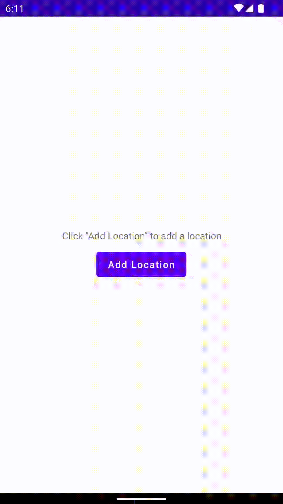

#### About:
An Android mobile application, developed in Kotlin, that allows users to search for a location and on selecting the location, shows the temperature in that location

#### Concepts used:
* Architecture used: MVVM
* Added support for view binding
* Added support for ViewModel
* Added support for Kotlin Co-Routines
* Added support for Retrofit, OKHTTPClient
* Data Classes, Parcelable support
* Suspend functions
* lifecycleScope and viewModelScope
* StateFlow support for listening to updates
* Search View, Constraint Layout, ProgressBar(circular), Recycler View
* ActivityResultContract support
* Completely Implemented in Kotlin

#### APIs used:
* For Fetching Locations "https://geocoding-api.open-meteo.com/v1/"
* For fetching weather "https://api.open-meteo.com/v1/"

Find additional details [here](https://open-meteo.com/)

#### Sample Recording
